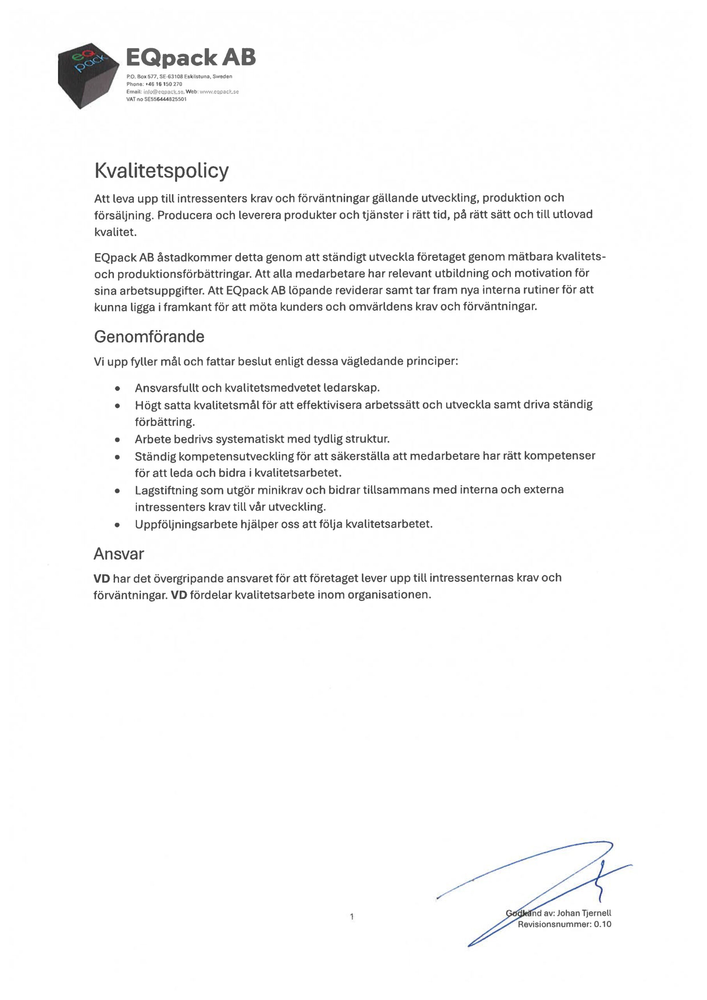
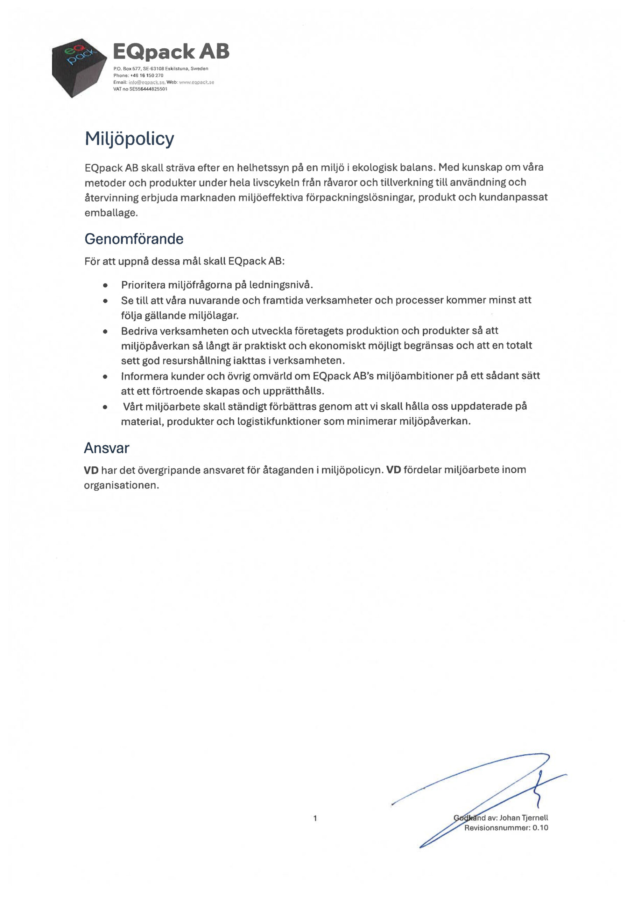


### Kvalitetsarbete ger bättre resultat
För oss är det viktigt att alltid erbjuda bästa möjliga produkter till våra kunder.  
Men det är minst lika viktigt att vår personal mår bra och känner sig trygga.

Vårt kvalitetsarbete utgår från SS-EN ISO9001, ett integrerat ledningssystem för kvalitet.  
Med systemet kan vi följa en orders väg genom organisationen, från offert till avslutad affär.  
På så sätt säkrar vi att resultatet blir det bästa möjliga för såväl kunder som personal.




## Kvalitetspolicy

## Miljöpolicy

